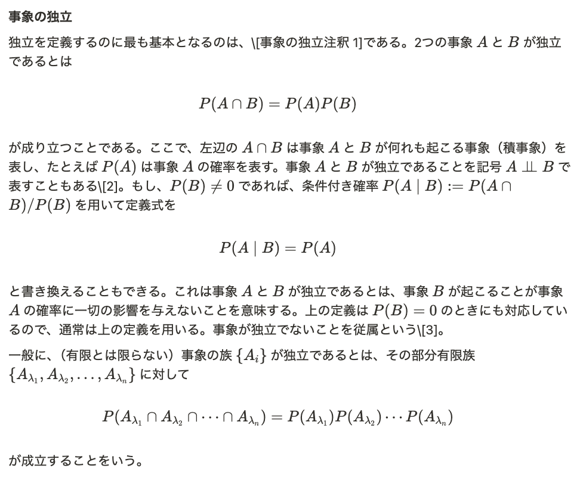

# ChatGpt to Notion 数式自動変換スクリプト

ChatGptの数式をNotionページ内に貼り付けた(Control Shift Vした)際のLaTeX形式の数式 (`$...$` や `$$...$$`) を、Notionのネイティブな「数式ブロック」および「インライン数式」に一括で自動変換するPythonスクリプトです。

数式を一つずつ手作業で変換する手間が無くなります。


スクリプト実行前のNotion画面([独立(確率論): Wikipedia](https://ja.wikipedia.org/wiki/%E7%8B%AC%E7%AB%8B_(%E7%A2%BA%E7%8E%87%E8%AB%96))の式をchatGPTに入力してNotionに貼り付けたもの)

スクリプト実行後のNotion画面



## 主な機能

  * **インライン数式 & ブロック数式の両方に対応**:
      * 文章中の `$E=mc^2$` はインライン数式に変換されます。
      * 独立した行の `$$...$$` は、専用の数式ブロックに変換されます。
  * **ページ全体を再帰的に処理**:
      * ページ直下のコンテンツだけでなく、トグルリストの中や、入れ子になった子ブロックなど、ページ内のあらゆる階層を探索して変換を実行します。
  * **幅広いブロックタイプをサポート**:
      * 段落、箇条書き、番号付きリスト、ToDoリスト、見出し、コールアウト、引用ブロック内の数式に対応しています。
      * **テーブル内のセル**に含まれる数式も変換対象です。

[//]: # (  * **堅牢なエラー処理**:)

[//]: # (      * Notion APIのレート制限（一度にアクセスしすぎた際のエラー）を自動で検知し、適切な時間待機してから処理を再開します。)

[//]: # (      * 万が一、処理に失敗したブロックがあった場合は、最後にそのIDを一覧で報告します。)

## ⚠️ 重要：実行前の注意点

このスクリプトは、**Notionのページ内容を直接変更します。**
万が一の事態に備え、**実行する前に対象ページのバックアップ（ページを複製）を必ず作成してください。**

## 1\. 事前準備 (Requirements)

スクリプトを実行するには、以下の4つが必要です。

### a. Python 3.x

お使いのコンピュータにPython 3がインストールされていることを確認してください。

### b. Pythonライブラリのインストール

このスクリプトは `requests` ライブラリを使用します。ターミナル（またはコマンドプロンプト）で以下のコマンドを実行してインストールしてください。

```bash
pip install requests
```

### c. Notion APIトークンの取得

1.  [Notionのマイインテグレーションページ](https://www.notion.so/my-integrations)にアクセスします。
2.  「**+ 新しいインテグレーション**」ボタンを押し、名前（例: "My LaTeX Converter"）を入力して送信します。
3.  作成されたインテグレーションのページで、「**シークレット**」タブに表示されているAPIトークン（`secret_...`で始まる文字列）をコピーします。これは後で使用します。

### d. ページへのコネクト追加とIDの取得

1.  **コネクトの追加**:
      * 数式を変換したいNotionページを開きます。
      * 右上の「**・・・**」メニューをクリックし、「**接続**」を選択します。
      * 検索窓に、先ほど作成したインテグレーション名（例: "My LaTeX Converter"）を入力し、表示されたものを選択して連携を許可します。
2.  **ページIDの取得**:
      * ブラウザでNotionページを開いた際のURLを確認します。
      * URLの末尾にある、32文字の英数字がページIDです。
      * 例: `https://www.notion.so/your-workspace/Page-Title-`**`xxxxxxxxxxxxxxxxxxxxxxxxxxxxxxxx`**
      * この32文字のIDをコピーしておきます。

## 2\. 実行方法 (Usage)

1.  **スクリプトのダウンロード**:
    このスクリプト（`.py`ファイル）をコンピュータに保存します。

2.  **環境変数の設定**:
    ターミナルで、先ほど取得した「APIトークン」と「ページID」を環境変数として設定します。

    **macOS / Linux の場合:**

    ```bash
    export NOTION_TOKEN="<Notion APIトークンを貼り付け>"
    export PAGE_ID="<ページIDを貼り付け>"
    ```
    
    *注意: 環境変数はターミナルを閉じるとリセットされます。永続化したい場合はbashrc/zshrcにvim等で書き込んでください*


[//]: # (3. )

[//]: # (    **Windows &#40;コマンドプロンプト&#41; の場合:**)

[//]: # ()
[//]: # (    ```bash)

[//]: # (    set "NOTION_TOKEN=<ここにあなたのNotion APIトークンを貼り付け>")

[//]: # (    set "PAGE_ID=<ここにあなたのページIDを貼り付け>")

[//]: # (    ```)

[//]: # ()
[//]: # (    **Windows &#40;PowerShell&#41; の場合:**)

[//]: # ()
[//]: # (    ```powershell)

[//]: # (    $env:NOTION_TOKEN="<ここにあなたのNotion APIトークンを貼り付け>")

[//]: # (    $env:PAGE_ID="<ここにあなたのページIDを貼り付け>")

[//]: # (    ```)


3.  **スクリプトの実行**:
    環境変数を設定したのと同じターミナルで、以下のコマンドを実行します。（ファイル名は適宜変更してください）

    ```bash
    python3 converter_math.py 
    ```

4.  **実行確認**:
    スクリプトが起動すると、最終確認のメッセージが表示されます。

    ```
    このスクリプトはNotionページの内容を直接変更します。
    必ず事前にページのバックアップ（複製）を作成してください。
    処理を続行しますか？ (y/n):
    ```

    `y` と入力してEnterキーを押すと、処理が開始されます。

処理が完了したら、Notionページをリロードして、数式が正しく変換されているか確認してください。

## ライセンス (License)

このプロジェクトは [MIT License](https://www.google.com/search?q=LICENSE) の下で公開されています。

## 免責事項 (Disclaimer)

このスクリプトの使用によって生じたいかなる損害についても、作成者は一切の責任を負いません。ご利用は自己責任でお願いいたします。必ず事前にページのバックアップを取得してください。